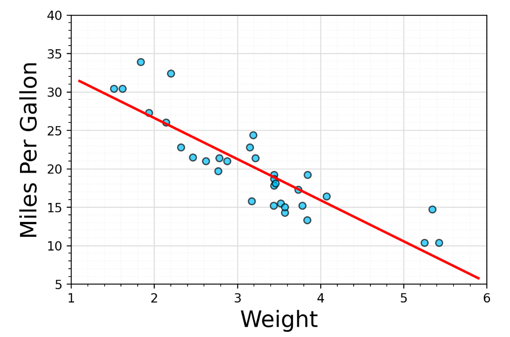

# Introduction to Locally Weighted Regression

Nitu Girish Mohan

## Locally Weighted Regression

With linear regression, one can make predictions as a weighted combination of the input feature values, with positive of negative weights; it is used for computing linear relationships between an input (X) and output (Y). To put it plainly, a straight line should be able to easily split/categorize the data (linearly seperable data). This follows the equation of:

 


However, if there is a non-linear relationship between X and Y, it might be better to utilize a locally weighted regression. This type of algorithm assigns weights to data points to overcome the problem of non-linearly seperable data. This a non-parametric algorithm meaning that it does not have set parameters like linear regression. Parameters (tau) are calculated for each data point based on the point's location. Points that are closer to x will get a higher "preference." It is important to note that this is a generalization of k-nearest Neighbor and there is not training phase. The work is done while making predictions. Weights are assigned by kernel smoothing. The kernel function is the bell shaped function with parameter tau. Larger tau will result in a smoother curve.

Definition of the kernels: https://en.wikipedia.org/wiki/Kernel_(statistics)

There are many choices of kernels for locally weighted regression. The idea is to have a function with one local maximum that has a compact support. Below is some of the different kernels we discussed in class:

```python
# Gaussian Kernel
def Gaussian(x):
  return np.where(np.abs(x)>4,0,1/(np.sqrt(2*np.pi))*np.exp(-1/2*x**2))
  
# Tricubic Kernel
def tricubic(x):
  return np.where(np.abs(x)>1,0,70/81*(1-np.abs(x)**3)**3)
  
# Epanechnikov Kernel
def Epanechnikov(x):
  return np.where(np.abs(x)>1,0,3/4*(1-np.abs(x)**2)) 
  
# Quartic Kernel
def Quartic(x):
  return np.where(np.abs(x)>1,0,15/16*(1-np.abs(x)**2)**2) 
```


**Main Idea:** Trends and associations are generally nonlinear; however, *locally*, trends can be interpreted linearly.

In this context, local properties are relative to a metric. A metric is a method by which we compute the distance between two observations. Observations contain multiple features, and if they are numeric, we can see them as vectors in a finite-dimensional Euclidean space.

The independent observations are the rows of the matrix X . Each row has a number of columns (this is the number of features) and we can denote it by p- As such, every row is a vector in R^p. The distance between two independent observations is the Euclidean distance between the two represented p- dimensional vectors. The equation is:


We shall have n different weight vectors because we have n different observations.

The message of this picture is that we are going to use kernels, such as Gaussian or similar shapes, for solving local linear regression problems.

<p align="center">

</p>


Drawbacks:
1. Need to evaluate whole dataset everytime
2. Higher computation cost
3. More memory required


The function below is one approach for the locally weighted regression by Alex Gramfort:

```python
# approach by Alex Gramfort

def lowess_ag(x, y, f=2. / 3., iter=3):
    """lowess(x, y, f=2./3., iter=3) -> yest
    Lowess smoother: Robust locally weighted regression.
    The lowess function fits a nonparametric regression curve to a scatterplot.
    The arrays x and y contain an equal number of elements; each pair
    (x[i], y[i]) defines a data point in the scatterplot. The function returns
    the estimated (smooth) values of y.
    The smoothing span is given by f. A larger value for f will result in a
    smoother curve. The number of robustifying iterations is given by iter. The
    function will run faster with a smaller number of iterations.
    """
    n = len(x)
    r = int(ceil(f * n))
    h = [np.sort(np.abs(x - x[i]))[r] for i in range(n)]
    w = np.clip(np.abs((x[:, None] - x[None, :]) / h), 0.0, 1.0)
    w = (1 - w ** 3) ** 3
    yest = np.zeros(n)
    delta = np.ones(n)
    for iteration in range(iter):
        for i in range(n):
            weights = delta * w[:, i]
            b = np.array([np.sum(weights * y), np.sum(weights * y * x)])
            A = np.array([[np.sum(weights), np.sum(weights * x)],
                          [np.sum(weights * x), np.sum(weights * x * x)]])
            beta = linalg.solve(A, b)
            yest[i] = beta[0] + beta[1] * x[i]

        residuals = y - yest
        s = np.median(np.abs(residuals))
        delta = np.clip(residuals / (6.0 * s), -1, 1)
        delta = (1 - delta ** 2) ** 2

    return yest
```


Here is another approach for locally weighted regression: 
```python
def lowess(x, y,x_new, kern, tau=0.05):
    # tau is called bandwidth K((x-x[i])/(2*tau))
    # tau is a hyper-parameter
    w = weights_matrix(x,x_new,kern,tau) 
    if np.isscalar(x_new):
      lm.fit(np.diag(w).dot(x.reshape(-1,1)),np.diag(w).dot(y.reshape(-1,1)))
      yest = lm.predict([[x_new]])[0][0]
    else:
      n = len(x_new)
      yest = np.zeros(n)
      #Looping through all x-points
      for i in range(n):
        lm.fit(np.diag(w[i,:]).dot(x.reshape(-1,1)),np.diag(w[i,:]).dot(y.reshape(-1,1)))
        yest[i] = lm.predict(x_new[i].reshape(-1,1)) 

    return yest
```

To show how this works, we can use the car dataset. We can analyze how well the regression does depending on the which kernel is used. By utilizing different kernel (smoothing) functions, we can attach different weights to points depending on the point's promixity to x.

To begin, we will first load in the data and look at the car's miles per gallon compared to its weight:


If we do a linear regression, you will see that the line does not follow the data very well:

```python
x = cars["wt"].values
y = cars["mpg"].values
lm = linear_model.LinearRegression()
model = lm.fit(x.reshape(-1,1),y)
xhat = np.array([1.1,5.9]).reshape(-1,1)
yhat = lm.predict(xhat)

fig, ax = plt.subplots(1,1)
plt.plot(xhat, yhat, '-',color='red',lw=2)
plt.scatter(cars["wt"],cars["mpg"],color='deepskyblue',ec='k',s=30,alpha=0.7)
plt.xlim(1,6)
plt.ylim(5,40)
plt.xlabel('Weight',fontsize=18)
plt.ylabel('Miles Per Gallon',fontsize=18)
ax.grid()
ax.grid(which='major', color='#DDDDDD', linewidth=0.8)
ax.grid(which='minor', color='#EEEEEE', linestyle=':', linewidth=0.5)
ax.set_axisbelow(True)
plt.minorticks_on()
plt.savefig("mtcars_line.png")
```




However, if we utilize a kernel function in our locally weighted regression, we get a much better output. In the code below, we define the bell shaped kernel function. As you can see in the plot, we get a much better regression compared to the linear one.

```python
def kernel_function(xi,x0,tau= .005): 
    return np.exp( - (xi - x0)**2/(2*tau))

def weights_matrix(x,tau):
  n = len(x)
  return np.array([kernel_function(x,x[i],tau) for i in range(n)]) 

def lowess_bell_shape_kern(x, y, tau = .005):
    """lowess_bell_shape_kern(x, y, tau = .005) -> the estimate of y denoted "yest"
    Locally weighted regression: fits a nonparametric regression curve to a scatterplot.
    The arrays x and y contain an equal number of elements; each pair
    (x[i], y[i]) defines a data point in the scatterplot. The function returns
    the estimated (smooth) values of y.
    The kernel function is the bell shaped function with parameter tau. Larger tau will result in a
    smoother curve. 
    """
    n = len(x)
    yest = np.zeros(n)

    #Initializing all weights from the bell shape kernel function    
    # here w is an nxn matrix
    w = weights_matrix(x,tau)    
    
    #Looping through all x-points
    for i in range(n):
        weights = w[:, i]
        lm.fit(np.diag(w[:,i]).dot(x.reshape(-1,1)),np.diag(w[:,i]).dot(y.reshape(-1,1)))
        yest[i] = lm.predict(x[i].reshape(-1,1)) 

    return yest
    
    
yhat = lowess_bell_shape_akern(x,y, tau= .001)
 
 
fig, ax = plt.subplots(1,1)
plt.plot(x[np.argsort(x)], yhat[np.argsort(x)], '-',color='red',lw=2) #argsort orders the data in increasining order
plt.scatter(cars["wt"],cars["mpg"],color='deepskyblue',ec='k',s=30,alpha=0.7)
plt.xlim(1,6)
plt.ylim(5,40)
plt.xlabel('Weight',fontsize=18)
plt.ylabel('Miles Per Gallon',fontsize=18)
ax.grid()
ax.grid(which='major', color='#DDDDDD', linewidth=0.8)
ax.grid(which='minor', color='#EEEEEE', linestyle=':', linewidth=0.5)
ax.set_axisbelow(True)
plt.minorticks_on()
plt.savefig("mtcars_line.png")
```


## Experiment with kernels

To continue our exploration of locally weighted regression, we can look at how kernels respond and decide which performs best. For this, I will be comparing Gaussian, Tricubic, Epanechnikov, and Quartic kernels.(For this exploration, I am working with simulated data.)

```python
#Initializing noisy non linear data
x = np.linspace(0,4,401)
noise = np.random.normal(loc = 0, scale = .2, size = len(x))
y = np.sin(x**2 * 1.5 * np.pi ) 
ynoisy = y + noise
xtrain, xtest, ytrain, ytest = tts(x,ynoisy,test_size=0.2,shuffle=True,random_state=123)
```


First Gaussian:

```python
kf = KFold(n_splits=10,shuffle=True,random_state=123)

mse_test_lowess = []
for idxtrain, idxtest in kf.split(x):
  xtrain = x[idxtrain]
  xtest = x[idxtest]
  ytrain = y[idxtrain]
  ytest = y[idxtest]
  # for our 1-dimensional input data we do not need scaling
  model_lw = Lowess(kernel=Gaussian,tau=0.02)
  model_lw.fit(xtrain,ytrain)
  mse_test_lowess.append(mse(ytest,model_lw.predict(xtest)))
print('The validated MSE for Lowess is : ' + str(np.mean(mse_test_lowess)) )
```
The validated MSE for Lowess is : 0.031105242933597725


Second Tricubic:

```python
kf = KFold(n_splits=10,shuffle=True,random_state=123)

mse_test_lowess = []
for idxtrain, idxtest in kf.split(x):
  xtrain = x[idxtrain]
  xtest = x[idxtest]
  ytrain = y[idxtrain]
  ytest = y[idxtest]
  # for our 1-dimensional input data we do not need scaling
  model_lw = Lowess(kernel=Tricubic,tau=0.02)
  model_lw.fit(xtrain,ytrain)
  mse_test_lowess.append(mse(ytest,model_lw.predict(xtest)))
print('The validated MSE for Lowess is : ' + str(np.mean(mse_test_lowess)) )
```
The validated MSE for Lowess is : 0.004232698784601303


Third Epanechnikov:

```python
kf = KFold(n_splits=10,shuffle=True,random_state=123)

mse_test_lowess = []
for idxtrain, idxtest in kf.split(x):
  xtrain = x[idxtrain]
  xtest = x[idxtest]
  ytrain = y[idxtrain]
  ytest = y[idxtest]
  # for our 1-dimensional input data we do not need scaling
  model_lw = Lowess(kernel=Epanechnikov,tau=0.02)
  model_lw.fit(xtrain,ytrain)
  mse_test_lowess.append(mse(ytest,model_lw.predict(xtest)))
print('The validated MSE for Lowess is : ' + str(np.mean(mse_test_lowess)) )
```
The validated MSE for Lowess is : 0.006252293296199783

Fourth Quartic:

```python
kf = KFold(n_splits=10,shuffle=True,random_state=123)

mse_test_lowess = []
for idxtrain, idxtest in kf.split(x):
  xtrain = x[idxtrain]
  xtest = x[idxtest]
  ytrain = y[idxtrain]
  ytest = y[idxtest]
  # for our 1-dimensional input data we do not need scaling
  model_lw = Lowess(kernel=Quartic,tau=0.02)
  model_lw.fit(xtrain,ytrain)
  mse_test_lowess.append(mse(ytest,model_lw.predict(xtest)))
print('The validated MSE for Lowess is : ' + str(np.mean(mse_test_lowess)) )
```
The validated MSE for Lowess is : 0.004029711359323845


References: 
1. https://www.geeksforgeeks.org/ml-locally-weighted-linear-regression/
2. https://xavierbourretsicotte.github.io/loess.
3. https://www.youtube.com/watch?v=to_LPkV1bnI&ab_channel=Trouble-Free 
4. https://www.cs.cmu.edu/afs/cs/project/jair/pub/volume4/cohn96a-html/node7.html
5. https://en.wikipedia.org/wiki/Kernel_(statistics)
6. Notebooks provided in class
